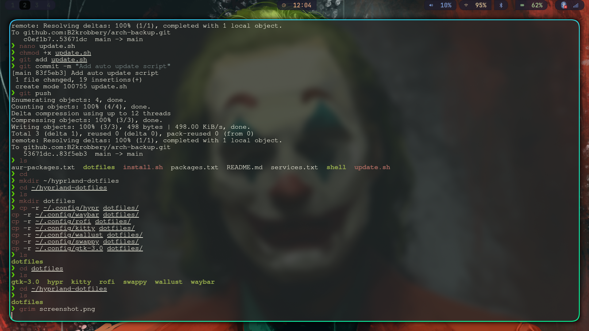

<div align="center">

# ✨ B2k Hyprland Setup

My personal **Arch Linux + Hyprland** desktop configuration.



</div>

---

## ⚙️ Components

* **Window Manager:** Hyprland
* **Status Bar:** Waybar
* **Launcher:** Rofi
* **Terminal:** Kitty
* **Color Generator:** Wallust
* **Screenshot Tool:** Swappy

---

## 📦 Installation

Clone the repository:

```bash
git clone https://github.com/B2krobbery/hyprland-dotfiles
```

Enter the directory:

```bash
cd hyprland-dotfiles
```

Make the installer executable:

```bash
chmod +x install.sh
```

Run the installer:

```bash
./install.sh
```

---

## 📁 Repository Structure

```
hyprland-dotfiles
├── dotfiles
│   ├── hypr
│   ├── waybar
│   ├── rofi
│   ├── kitty
│   ├── wallust
│   ├── swappy
│   └── gtk-3.0
│
├── install.sh      # installs configuration files
├── update.sh       # pushes config updates to GitHub
├── screenshot.png  # desktop preview
└── README.md
```

---

## 🔄 Updating (for repository owner)

After modifying configs, push changes with:

```bash
./update.sh
```

---

## 💻 Requirements

This setup expects the following software installed:

* Hyprland
* Waybar
* Rofi
* Kitty
* Wallust
* Swappy

Install them via pacman:

```bash
sudo pacman -S hyprland waybar rofi kitty swappy
```

---

## ⭐ Support

If you like this setup, consider **starring the repository**.

</div>
